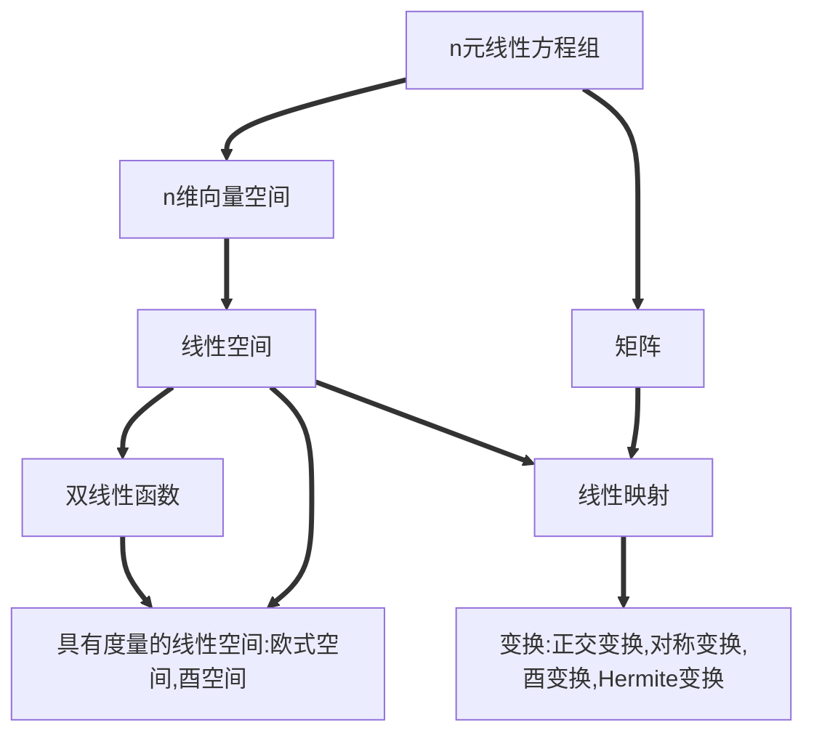
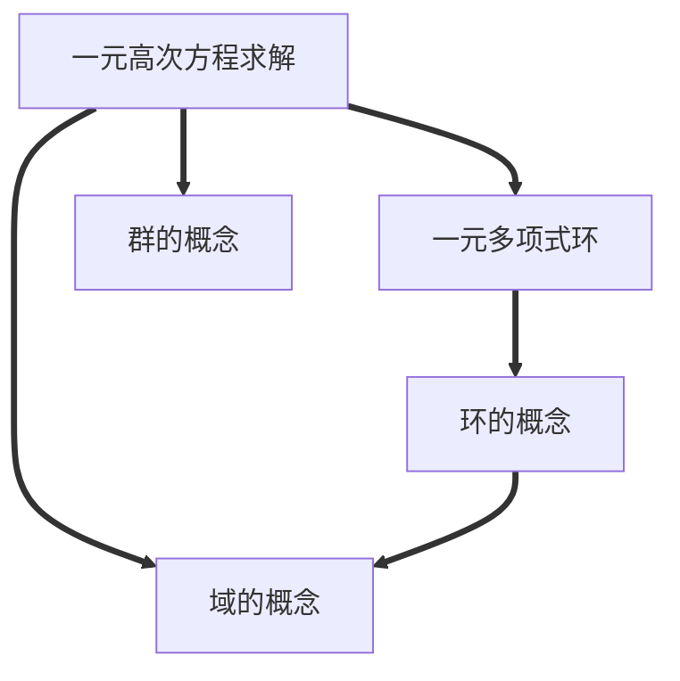

[TOC]
# 高等代数的研究课题
### n元线性方程求解 
第一部分主线线性空间和线性映射

```mermaid
graph TB;
    a0[n元线性方程组] ==> b1[n维向量空间];
    b1 ==> c[线性空间]
    c ==> d[双线性函数];
    c ==> e[具有度量的线性空间:欧式空间,酉空间]
    d==>e
    a0 ==> c1[矩阵]
    c1 ==> g[线性映射]
    c ==> g
    g ==> en[变换:正交变换,对称变换,</br>酉变换,Hermite变换]
```
### 一元高次方程求解
第二部分研究一元(n元)多项式环的结构及其通用性质

```mermaid
graph TB;
    a[一元高次方程求解] ==> b[一元多项式环]
    b==>c[环的概念]
    a==>d[域的概念]
    c==>d
    a==>e[群的概念]
```

# 线性方程组的解法
## 矩阵的初等变换